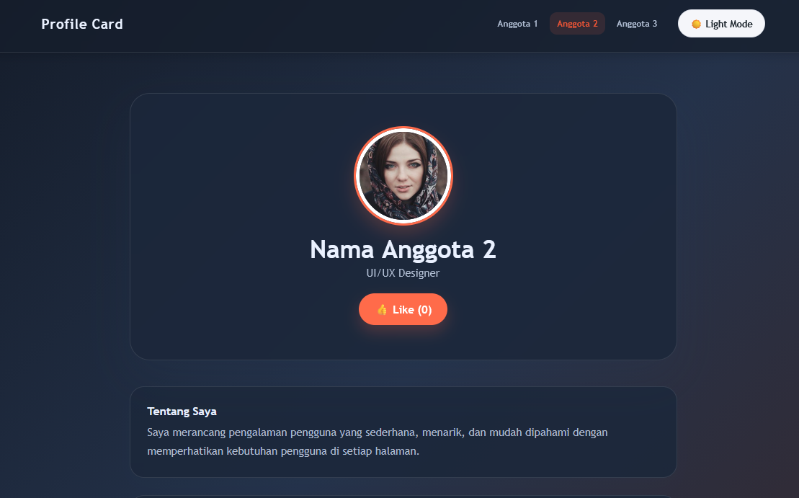

# Profile Card

Profile Card adalah halaman kartu profil interaktif untuk tiga anggota tim, dengan fitur pergantian anggota, dark mode, dan like counter, dibuat sebagai study case GitReady 2.0 (Git & GitHub).

---

## Visualisasi

<!-- Ganti dengan screenshot halaman kalian (upload ke repo, misalnya folder /screenshots) -->



---

## Tech Stack

---

## Fitur Utama

- [x] Pindah profil antar anggota lewat navbar
- [x] Toggle Dark Mode
- [x] Like Counter interaktif 
- [x] Responsive layout 
---

## Contribution

| Nama | Role | Kontribusi |
|---|---|---|
| Gavriel Miracle | Project Initiator | Membuat repository, mengatur akses kolaborator, commit `index.html` |
| Eunica Valencia | Styling Engineer | Membuat branch `styling`, menambahkan & menghubungkan `style.css` |
| Jessica Gunawan | Script Engineer | Membuat branch `scripting`, menambahkan & menghubungkan `script.js` |

---

## How to Run

1. Clone repository ini:

   ```bash
   git clone <url-repo-kalian>
   ```

2. Buka folder hasil clone, lalu klik dua kali file `index.html` (atau klik kanan → Open with → Browser).

---

## What I Learned

- Cara kerja alur kolaborasi di Git: membuat branch terpisah, commit, push, lalu menggabungkan lewat Pull Request
- Pentingnya code review sebelum merge ke branch `main`
- Cara mengenali dan menyelesaikan merge conflict, terutama saat beberapa orang mengubah file yang sama (`index.html`)
- Menghubungkan file CSS dan JavaScript ke HTML, serta memanipulasi DOM dengan JavaScript
- Membuat dark mode dengan CSS variables dan class toggle

---
